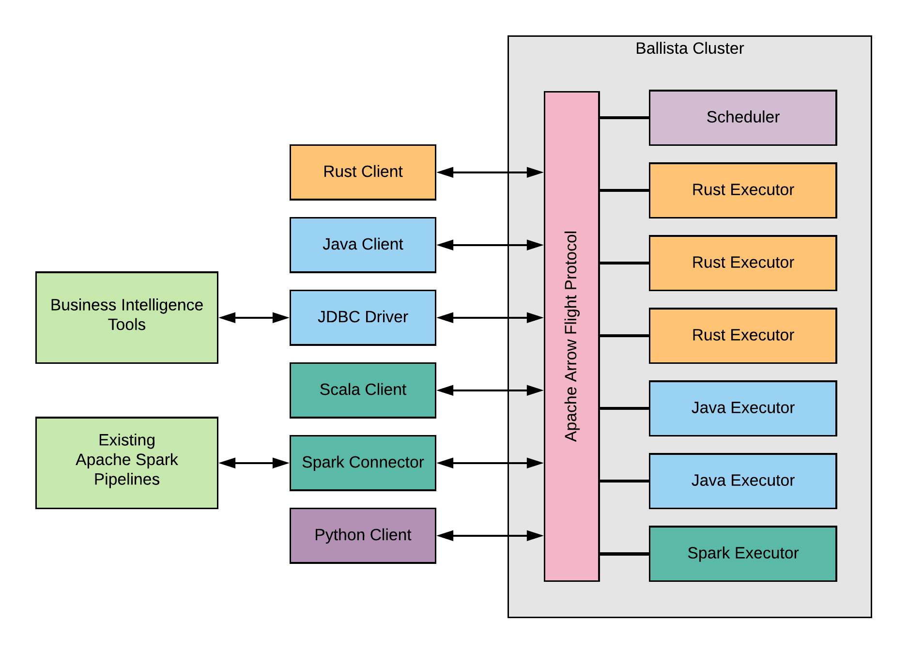

# Ballista: Distributed Compute Platform

[](https://opensource.org/licenses/Apache-2.0)
[](https://crates.io/crates/ballista)
[](https://gitter.im/ballista-rs/community?utm_source=badge&utm_medium=badge&utm_campaign=pr-badge&utm_content=badge)

## Overview

Ballista is a distributed compute platform primarily implemented in Rust, using Apache Arrow as the memory model. It is 
built on an architecture that allows other programming languages to be supported as first-class citizens without paying
a penalty for serialization costs.

The foundational technologies in Ballista are:

- [Apache Arrow](https://arrow.apache.org/) memory model and compute kernels for efficient processing of data.
- [Apache Arrow Flight Protocol](https://arrow.apache.org/blog/2019/10/13/introducing-arrow-flight/) for efficient data transfer between processes.
- [Google Protocol Buffers](https://developers.google.com/protocol-buffers) for serializing query plans.
- [Docker](https://www.docker.com/) for packaging up executors along with user-defined code.

Ballista can be deployed in [Kubernetes](https://kubernetes.io/), or as a standalone cluster using [etcd](https://etcd.io/) for discovery.

## Architecture Diagram

The following diagram highlights some of the integrations that will be possible with this unique architecture. Note 
that not all components shown here are available yet.



## How does this compare to Apache Spark?

Ballista differs from Apache Spark in many ways.

- Due to the use of Rust, memory usage can be up to 100x lower than Apache Spark which means that more processing can 
fit on a single node, reducing the overhead of distributed compute.
- Also due to the use of Rust, there are no "cold start" overheads. The first run of a query can be up to 10x faster 
than Apache Spark.
- The use of Apache Arrow as the memory model and network protocol means that data can be exchanged between executors in
any programming language with minimal serialization overhead.
- Ballista is columnar rather than row-based, meaning that it can take advantage of vectorized processing both on the
CPU (using SIMD) and on the GPU. GPU support isn't available yet but will be available in a future release.

## Example Rust Client

```rust
#[tokio::main]
async fn main() -> Result<()> {

    let nyc_taxi_path = "/mnt/nyctaxi/parquet/year=2019";
    let executor_host = "localhost";
    let executor_port = 50051;

    let ctx = Context::remote(executor_host, executor_port, HashMap::new());

    let results = ctx
        .read_parquet(nyc_taxi_path, None)?
        .aggregate(vec![col("passenger_count")], vec![max(col("fare_amount"))])?
        .collect()
        .await?;

    // print the results
    pretty::print_batches(&results)?;

    Ok(())
}
```

## Status

Distributed execution using async Rust has now been proven and we are working towards a 0.3.0 release in August 2020 
that will support the following capabilities.

### Operators:

- Projection
- Selection
- Hash Aggregate
- Limit

### Expressions:

- Basic aggregate expressions (`MIN`, `MAX`, `SUM`, `COUNT`, `AVG`)
- Boolean expressions (`AND`, `OR`, `NOT`)
- Comparison expressions (`==`, `!=`, `<=`, `<`, `>`, `>=`)
- Basic math expressions (`+`, `-`, `*`, `/`, `%`)
- Rust user-defined functions (UDFs)
- Java user-defined functions (UDFs)

### File Formats:

- CSV
- Parquet

## Roadmap

After the 0.3.0 release we will start working on more complex operators, particularly joins, using the TPCH
benchmarks to drive requirements. The full roadmap is available [here](https://github.com/ballista-compute/ballista/milestones?direction=asc&sort=title&state=open).

## More Examples

The following examples should help illustrate the current capabilities of Ballista

- [Distributed query execution in Rust](https://github.com/ballista-compute/ballista/tree/main/rust/examples/distributed-query)
- [TPC-H Benchmark](https://github.com/ballista-compute/ballista/tree/main/rust/examples/tpch)
- [Rust bindings for Apache Spark](https://github.com/ballista-compute/ballista/tree/main/rust/examples/apache-spark-rust-bindings)

## Documentation

The [user guide](https://ballistacompute.org/docs/) is hosted at [https://ballistacompute.org](https://ballistacompute.org/), along with the [blog](https://ballistacompute.org/) where 
news and release notes are posted.
## Contributing

See [CONTRIBUTING.md](CONTRIBUTING.md) for information on contributing to this project.


